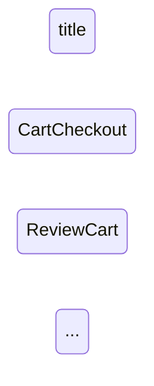

# Examples

This folder contains sample SCXML statecharts for common real-world flows,
plus CLIs that run the library's pipelines so you can see the output:

- `ast-print.mjs` — `parse -> validate -> print` (ASCII visual AST tree)
- `ast-to-mermaid.mjs` — `parse -> validate -> toMermaid` (Mermaid state diagram)

## Sample statecharts

| File                        | Flow                                    | Concepts shown                                           |
| --------------------------- | --------------------------------------- | -------------------------------------------------------- |
| `scxml/cart-checkout.scxml` | Online shopping cart checkout           | `<parallel>` regions, conditional transitions, datamodel |
| `scxml/reservation.scxml`   | Book a reservation (restaurant / hotel) | Sequential journey, `<initial>` block, rework / cancel   |
| `scxml/auth-login.scxml`    | User authentication / login             | Nested atomic states, `<history>` pseudo-state, guards   |

## Running the AST printer

First build the library so the CLIs can import `dist/index.mjs`:

```bash
npm run build
```

Then run the CLI against any of the sample statecharts:

```bash
# Print to stdout
node examples/ast-print.mjs examples/scxml/cart-checkout.scxml

# Or via npm scripts
npm run examples:ast:cart
npm run examples:ast:reservation
npm run examples:ast:auth

# Any SCXML file works
node examples/ast-print.mjs my-own-flow.scxml
```

### Options

```text
Usage:
  node examples/ast-print.mjs <path-to.scxml> [options]

Options:
  -o, --out <file>      Write the AST output to <file> instead of stdout.
  --no-metadata         Hide domain metadata blocks.
  --no-datamodel        Hide the datamodel section.
  --no-transitions      Hide transitions on each state.
  --include-exec        Include executable content detail.
  -h, --help            Show this help.
```

### Write to a file

```bash
node examples/ast-print.mjs examples/scxml/reservation.scxml --out build/reservation-ast.txt
```

The CLI prints validation diagnostics (non-fatal) to stderr alongside the
AST, and exits non-zero if parsing fails. This makes it handy for eyeballing
a hand-written flow or diffing AST output after refactors.

## Rendering a Mermaid state diagram

Mermaid renders natively in VS Code (Markdown preview), GitHub, Notion, and
Mermaid Live Editor, so `ast-to-mermaid.mjs` gives you an IDE-renderable
visualization straight from the same headless AST:

```bash
# Print the diagram to stdout
node examples/ast-to-mermaid.mjs examples/scxml/cart-checkout.scxml

# Or via npm scripts
npm run examples:mermaid:cart
npm run examples:mermaid:reservation
npm run examples:mermaid:auth
```

### Wrap as Markdown for IDE preview

The `--md` flag wraps the diagram in a ` ```mermaid ` code fence so you can
paste it straight into a Markdown file and preview it in the editor:

```bash
node examples/ast-to-mermaid.mjs examples/scxml/reservation.scxml --md --out diagram.md
```

### Options

````text
Usage:
  node examples/ast-to-mermaid.mjs <path-to.scxml> [options]

Options:
  -o, --out <file>     Write the diagram to <file> instead of stdout.
  --md                 Wrap the diagram in a ```mermaid code fence.
  --direction <dir>    Diagram direction: 'LR' (default) or 'TB'.
  --no-title           Omit the diagram title.
  --no-edge-labels     Omit event/condition labels on edges.
  -h, --help           Show this help.
````

### Example output


